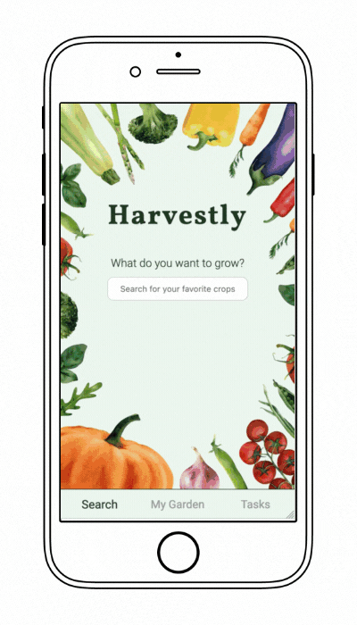

## Harvestly

You want to grow crops on your balcony or in you garden but don't know how to start?
That's what Harvestly is for! Harvestly will help you find crops quickly, show you how to plant them and help you care for them.

This app was developed as my capstone project during the final four weeks of the neuefische Web Development Bootcamp in Hamburg, Germany.

This app is optimized for mobile usage, so please switch your browser to responsive mode (iPhone 6/7/8).

---

## App impressions

  

---

## Tech stack

- Openfarm API
- React
- PropTypes
- Styled Components
- Storybook
- React Testing Library
- Jest
- Vercel

---

## How to set it up

- clone this repository
- install all npm dependencies  
   `npm install`
- to run the app in development mode `npm start`, then open [http://localhost:3000](http://localhost:3000) to view it in the browser
- to run Storybook  
  `npm run storybook`
- to run React Testing Library & Jest  
  `npm test`
- to create a build ready for deploying:
  `npm run build`
