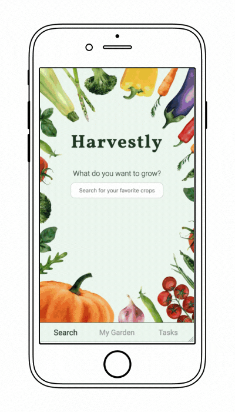

## Harvestly

You want to grow crops on your balcony or in you garden but don't know how to start?
That's what Harvestly is for! Harvestly will help you find crops quickly, show you how to plant them and help you care for them.

This app was developed as my capstone project during the final four weeks of the neuefische Web Development Bootcamp in Hamburg, Germany.

This app is optimized for mobile usage, so please switch your browser to responsive mode (iPhone 6/7/8).

---

## App impressions

  

---

## Tech stack

- Crops API, built to replace OpenFarm API because OpenFarm is now archived
- React
- PropTypes
- Styled Components
- Storybook
- React Testing Library
- Jest
- Vercel

---

## API

Harvestly was originally built with the OpenFarm API. Since OpenFarm is now archived, the app now uses a custom `crops-api` service with the crop data needed for search and detail pages.

---

## How to set it up

- clone this repository
- install all npm dependencies  
   `npm install`
- start the crops API from the `crops-api` repository  
  `npm run seed && npm run dev`
- copy `.env.example` to `.env.local` if your crops API does not run on `http://localhost:4000`
- to run the app in development mode `npm start`, then open the local Vite URL printed in your terminal
- to run Storybook  
  `npm run storybook`
- to run React Testing Library & Jest  
  `npm test`
- to create a build ready for deploying:
  `npm run build`
